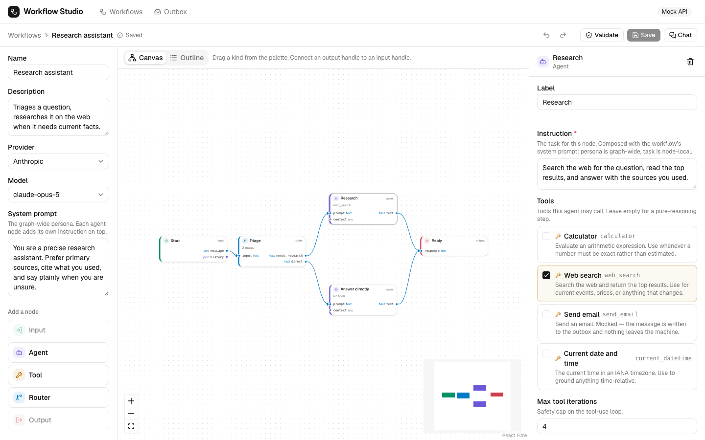

# Workflow Studio

Build a graph of AI agents, tools and routers, save it, chat with it, and see
every step the run took.



|                                   |                                        |
| --------------------------------- | -------------------------------------- |
| [`frontend/`](frontend/README.md) | React + TypeScript builder and chat UI |
| [`backend/`](backend/README.md)   | FastAPI service and execution engine   |

## Features

- **Visual builder** — drag nodes onto a canvas, connect typed ports, and
  configure each node in a form generated from the backend's own JSON Schema.
- **Agents with tools** — calculator, web search, current time and email, called
  by the model through a hand-written tool-use loop.
- **Routers** — the model picks a branch; everything reachable only through the
  others is skipped and reported as skipped.
- **Full run timeline** — every node, edge transfer, tool call and routing
  decision, in order, for both live and replayed runs.
- **Runs without a backend** — the frontend ships a complete in-browser mock of
  the API, so the product works on a clean checkout.

**Stack** — React 19 · TypeScript · Vite · Tailwind · React Flow · TanStack Query
· Zustand · FastAPI · Pydantic · SQLModel · SQLite. No agent framework.

## Prerequisites

|         | Version          | Check with          |
| ------- | ---------------- | ------------------- |
| Python  | 3.13+            | `python3 --version` |
| Node.js | 20.19+ or 22.12+ | `node -v`           |
| uv      | any recent       | `uv --version`      |

Install `uv` with `curl -LsSf https://astral.sh/uv/install.sh | sh`, or use the
pip fallback in the [backend README](backend/README.md#setup).

An Anthropic API key is required to run workflows, but not to browse or edit
them.

## Quick start

### 1. Backend

```bash
cd backend
uv sync
cp .env.example .env
```

Set your key in `backend/.env`:

```ini
ANTHROPIC_API_KEY=sk-ant-...
LLM_MODEL=claude-sonnet-5        # or claude-opus-5, claude-haiku-4-5
```

Seed the demo workflows and start the server:

```bash
uv run python -m app.seed
uv run uvicorn app.main:app --reload --port 8000
```

**Leave it running** and open a second terminal for the frontend.

<a id="without-uv"></a>

<details>
<summary>Without <code>uv</code></summary>

```bash
cd backend
python3.13 -m venv .venv && source .venv/bin/activate
pip install -r requirements.txt
cp .env.example .env            # then add ANTHROPIC_API_KEY
python -m app.seed
uvicorn app.main:app --reload --port 8000
```

</details>

### 2. Frontend

```bash
cd frontend
npm install
cp .env.example .env
```

Set `VITE_USE_MOCKS=false` in `frontend/.env` — the example ships in mock mode —
then start the dev server:

```bash
npm run dev
```

### 3. Verify

```bash
curl http://localhost:8000/api/health
# {"status":"ok","provider":"anthropic","model":"claude-sonnet-5","llm_configured":true}
```

Open <http://localhost:5173>. Two seeded workflows should be listed. Open **Math
helper** and ask _"A dinner bill is $1200 with 8% tax, split 3 ways — what does
each person pay?"_; the timeline will show real `calculator` calls.

|          |                                    |
| -------- | ---------------------------------- |
| App      | <http://localhost:5173>            |
| API docs | <http://localhost:8000/docs>       |
| Health   | <http://localhost:8000/api/health> |

## Running without a backend

No API key, no Python:

```bash
cd frontend
npm install && cp .env.example .env      # VITE_USE_MOCKS=true is the default
npm run dev
```

MSW serves the full API in the browser, seeded with two workflows and realistic
run timelines. See the [frontend README](frontend/README.md#the-mock-api).

## Configuration

Each half has its own `.env`. Both are gitignored; only the `.env.example`
templates are committed. They stay separate because `backend/.env` holds real
secrets, while every `VITE_*` variable is inlined into the browser bundle at
build time and is therefore public.

Variable reference: [backend](backend/README.md#configuration) ·
[frontend](frontend/README.md#configuration).

## Tests

```bash
cd backend  && uv run pytest        # 222 tests
cd frontend && npm test             # 79 tests
```

Neither suite needs an API key, a browser or network access.

```bash
cd backend  && uv run ruff check app tests
cd frontend && npm run typecheck && npm run lint
```

## Troubleshooting

| Symptom                           | Fix                                                                     |
| --------------------------------- | ----------------------------------------------------------------------- |
| UI shows a "Mock API" badge       | Set `VITE_USE_MOCKS=false` and restart — Vite reads env only at startup |
| `503 missing_api_key`             | Check `backend/.env`, then `curl …/api/health` for `llm_configured`     |
| Empty workflow list               | `cd backend && uv run python -m app.seed`                               |
| `Address already in use`          | `lsof -ti:8000 \| xargs kill`                                           |
| Frontend requests 404             | Backend not running — the Vite proxy expects `:8000`                    |
| `uv sync` fails on Python version | `uv python install 3.13`                                                |
| Search results look synthetic     | Expected without `SEARCH_API_KEY`; add a Tavily key for live search     |

## Design docs

`plan.md` (whole-system design) · `frontend-plan.md` · `backend-plan.md` ·
`frontend-imp.md` (the contract between the two halves).
