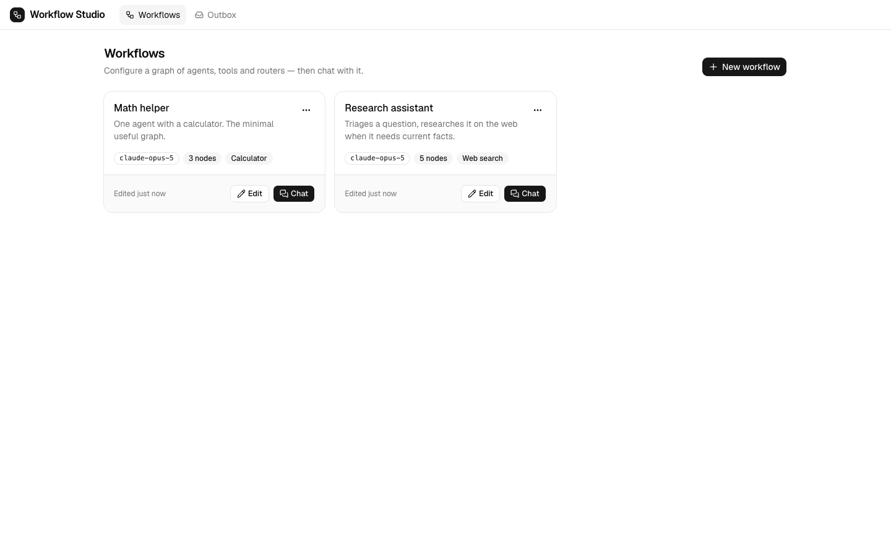
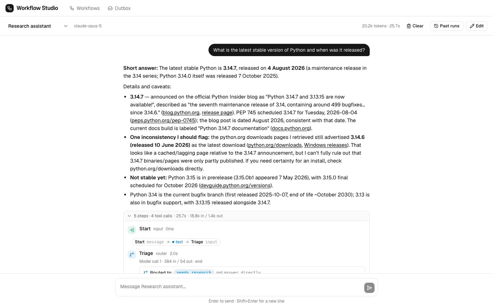

# Workflow Studio — Frontend

React + TypeScript client for Workflow Studio: a canvas for building graphs of
agents, tools and routers, and a chat view that shows every step a run took.

The API is served by [`../backend`](../backend). For full-stack setup, see the
[root README](../README.md).

## Requirements

- Node.js 20.19+ or 22.12+ (required by Vite 8)

## Setup

```bash
npm install
cp .env.example .env
npm run dev                # http://localhost:5173
```

The app runs **with or without the backend**. `VITE_USE_MOCKS=true` (the default)
serves the entire API from MSW in the browser, seeded with two workflows — so a
clean checkout is immediately usable. Set it to `false` to use the real backend;
the dev server proxies `/api` to `:8000`.

## Scripts

| | |
|---|---|
| `npm run dev` | Dev server |
| `npm run build` | Type-check and build for production |
| `npm run preview` | Serve the production build |
| `npm test` | Unit tests — 79 tests, no browser needed |
| `npm run typecheck` | `tsc -b --force` |
| `npm run lint` / `npm run format` | oxlint / prettier |
| `npm run gen:api` | Regenerate `src/types/api.generated.ts` from the running backend's OpenAPI schema |

## Configuration

| Variable | Default | |
|---|---|---|
| `VITE_USE_MOCKS` | `true` | `false` to talk to the real backend |
| `VITE_API_BASE_URL` | *(empty)* | Leave empty to use the dev proxy |

`VITE_*` variables are inlined into the bundle at build time and are visible to
anyone who loads the page — never put a secret in `frontend/.env`. Vite reads
them at startup, so restart the dev server after a change.

## Screenshots

**Workflow list** — each workflow with its model, node count and the tools it uses.



**Chat** — the answer is the primary content; the steps that produced it sit
underneath, collapsed after the first turn.



**Builder** — typed ports, connections you can only draw where they are legal,
and a config form generated from the backend's JSON Schema.


## Project structure

```
src/
├─ types/          api.ts · api.generated.ts · events.ts · ui.ts
├─ lib/            client · queries · ports · events · jsonSchema
│                  nodeVisuals · nodeSummary · richText · utils
├─ store/          editorStore.ts
├─ hooks/          useChatSession · useDebouncedCommit · useEditorShortcuts · useMediaQuery
├─ mocks/          browser · handlers · fixtures · db · validate
├─ pages/          WorkflowList · WorkflowEditor · Chat · Outbox · NotFound
└─ components/     ui/ (shadcn) · layout/ · common/ · workflow/ · builder/ · chat/
```

Business logic lives in `lib/`, not in components: port rules in `ports.ts`,
event reduction in `events.ts`, schema interpretation in `jsonSchema.ts` — each
independently tested.

## Architecture

### Schema-driven UI

A workflow is data, not code. The backend publishes node kinds, their port
contracts and their config JSON Schemas at `/api/node-kinds`, and the builder
renders from that — so **adding a node kind on the backend needs no frontend
change**.

Two components carry this:

- `builder/NodeConfigForm.tsx` never mentions a node kind. It renders whatever
  JSON Schema it is handed, and serves both node config and tool arguments.
- `builder/nodes/BaseNode.tsx` renders every kind on the canvas from the
  published spec. A kind the frontend has never heard of still draws with the
  right ports.

### The event log

Every observable step in a run — node started, data crossed an edge, tool called,
router decided — is one `RunEvent` in an ordered array. `lib/events.ts` reduces
that array into what the UI draws.

A live run and a replayed one go through the same reducer, so a stored run cannot
drift from a fresh one. It already handles `partial`/`final` deltas, so adding
streaming changes only what feeds it. Sorting is by `seq`, never `ts`.

### State boundary

Three stores, non-overlapping:

| | Owns |
|---|---|
| **TanStack Query** | Server state: workflows, node kinds, tools, providers, runs, emails |
| **Zustand** (`store/editorStore.ts`) | The unsaved builder draft, plus undo/redo |
| **React `useState`** | Ephemeral UI: dialogs, composer text, active tab |

Builder mount → Query fetches → `hydrate()` copies in once → edits mutate Zustand
→ Save sends `toInput()` → `markSaved()`. Nothing writes to the Query cache from
Zustand, and no query function reads Zustand.

### Connection rules

`lib/ports.ts` mirrors the backend rule — `any` connects to anything, identical
types connect, `text ↔ json` is rejected — and additionally refuses
self-connections, duplicate edges and anything that would close a cycle.
`POST /validate` remains the authority; these rules exist to make an illegal
connection un-draggable.

One deliberate relaxation: input ports are single-assignment *except* when the
two sources sit behind different output ports of the same router, which is what
makes `input → router → {A|B} → output` legal. See `areMutuallyExclusive`.

## The mock API

With `VITE_USE_MOCKS=true`, MSW serves the whole API from the browser. Workflows
persist in `localStorage` and chat transcripts in `sessionStorage`. **Mock API →
Reset demo data** in the header restores the seed.

Run fixtures include a real tool call and result, one `edge.transfer` per
traversed edge, a `route.decision` and a pruned `node.skipped`. Failure paths are
reachable by keyword:

| Say this in chat | |
|---|---|
| anything | A normal run with a full timeline |
| `…fail…` | A tool call errors and the agent recovers |
| `…refuse…` | The run ends in `run.error` with code `refusal` |
| `boom` | HTTP 500 |
| `nokey` | HTTP 401 `missing_api_key` |

The mock layer is only ever imported dynamically, so deleting `src/mocks` breaks
nothing else.

## Accessibility

- **Chat** — Enter sends, Shift+Enter newlines.
- **Builder** — ⌘S/Ctrl+S saves, ⌘Z / ⇧⌘Z step history, Delete removes the
  selection. All stand down while a text field has focus.
- **The Outline tab is not a fallback.** Dragging on a canvas is unusable with a
  keyboard or a screen reader, so the same graph is fully editable as a list —
  nodes, connections, and a type-filtered connect form. Both views read and write
  the same store.
- Icon-only buttons carry `aria-label`s; a run's pending state is an `aria-live`
  region; `prefers-reduced-motion` is honoured globally.
- Under 1024px the inspector becomes a sheet; under 1280px the settings rail does
  the same.

## Testing

```bash
npm test        # 79 tests, no browser needed
```

| File | Covers |
|---|---|
| `lib/ports.test.ts` | Type compatibility, cycles, occupancy, dynamic router ports |
| `lib/events.test.ts` | The reducer — streaming deltas, out-of-order input, unknown events |
| `lib/jsonSchema.test.ts` | Every supported field shape, plus `$ref` and `Optional[T]` |
| `store/editorStore.test.ts` | Edge cascade on delete, connect rejection, undo/redo |
| `mocks/handlers.test.ts` | The mock API end to end, including its failure fixtures |

End-to-end tests are out of scope at this size; the UI was verified by driving a
real browser during development.

## Limitations

- `tool` nodes take literal arguments only — no per-argument wired ports.
- No autosave. Explicit save avoids persisting half-finished graphs; leaving with
  unsaved changes is guarded.
- The unsaved-changes guard does not use `useBlocker`, which needs a data router;
  in-app exits route through a confirm dialog and `beforeunload` covers the tab.
- Single theme. The CSS variables are in place if dark mode is ever wanted.
